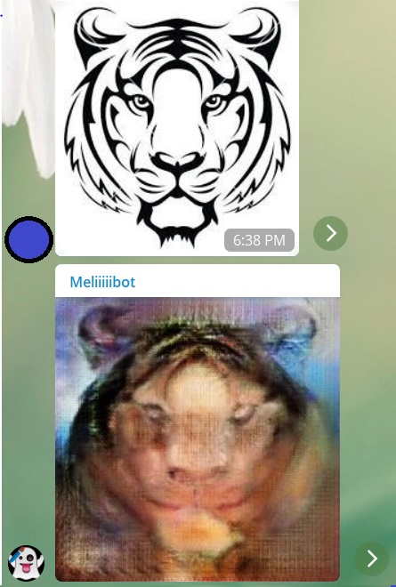
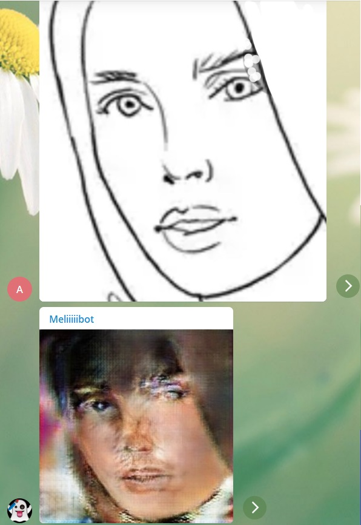

# FDBot
Telegram Bot for generating faces corresponding to a drawing as its input, using Pix2Pix.

# Model
the main model is from this [Pix2Pix article](https://arxiv.org/pdf/1611.07004v1.pdf) using their saurce code with some modifications and completions to be used in a Telegram bot. 

# Data
the target faces and their corresponding input drawings are from celebA dataset and their edge maps derived by the canny edge detection algorithm. 

# Result

## on test data

## on hand drawn and other paintings

### My Brother:)

### Me :)

